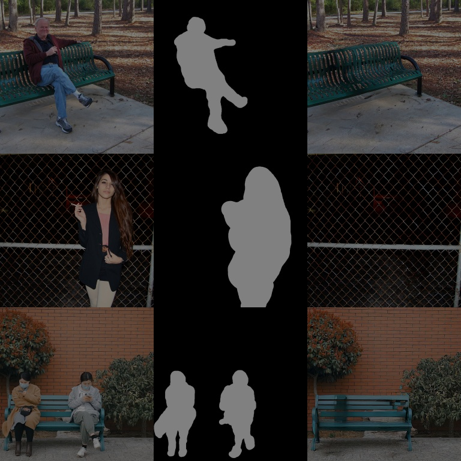

# Stable Diffusion for Inpainting without prompt conditioning

<p align="right">
<a href="https://pytorch.org/"></a>
<a href="https://pytorch.org/"></a>
<!-- <a href="https://github.com/lorenzo-stacchio/Stable-Diffusion-Inpaint"></a> -->
</p>

[Stable Diffusion](#stable-diffusion-v1) is a latent text-to-image diffusion
model. The authors trained models for a variety of tasks, including Inpainting. In this project, I focused on providing a good codebase to easily fine-tune or train from scratch the Inpainting architecture for a target dataset.



## Original paper
[**High-Resolution Image Synthesis with Latent Diffusion Models**](https://ommer-lab.com/research/latent-diffusion-models/)<br/>
[Robin Rombach](https://github.com/rromb)\*,
[Andreas Blattmann](https://github.com/ablattmann)\*,
[Dominik Lorenz](https://github.com/qp-qp)\,
[Patrick Esser](https://github.com/pesser),
[Björn Ommer](https://hci.iwr.uni-heidelberg.de/Staff/bommer)<br/>
_[CVPR '22 Oral](https://openaccess.thecvf.com/content/CVPR2022/html/Rombach_High-Resolution_Image_Synthesis_With_Latent_Diffusion_Models_CVPR_2022_paper.html) |
[GitHub](https://github.com/CompVis/latent-diffusion) | [arXiv](https://arxiv.org/abs/2112.10752) | [Project page](https://ommer-lab.com/research/latent-diffusion-models/)_


  
## Python environment

### Pip

Python [`3.6.8`](https://www.python.org/downloads/release/python-368/) environment built with pip for `CUDA 10.1` and tested on a `Tesla V100` gpu (Centos 7 OS).

```
pip install -r requirements.txt
```

### Conda environment of the [original repo](https://github.com/CompVis/stable-diffusion#requirements)
A suitable [conda](https://conda.io/) environment named `ldm` can be created
and activated with:

```
conda env create -f environment.yaml
conda activate ldm
```

You can also update an existing [latent diffusion](https://github.com/CompVis/latent-diffusion) environment by running

```
conda install pytorch torchvision -c pytorch
pip install transformers==4.19.2 diffusers invisible-watermark
pip install -e .
``` 

## Inpainting with Stable Diffusion

In this project, I focused on the inpainting task, providing a good codebase to easily fine-tune or train the model from scratch.

### **Reference Sampling Script**

Here is provided a simple reference sampling script for inpainting.

For this use case, you should need to specify a ```path/to/input_folder/``` that contains an image paired with their mask (e.g., image1.png - image1_mask.png) and a ```path/to/output_folder/``` where the generated images will be saved.

To have meaningful results, you should download inpainting weights provided by the authors as a baseline with:

```
wget -O models/ldm/inpainting_big/model_compvis.ckpt https://ommer-lab.com/files/latent-diffusion/inpainting_big.zip --no-check-certificate
```

N.B. Even if the file was provided as a zip file, it corresponds to [a checkpoint file saved with pytorch-lightning](https://github.com/CompVis/stable-diffusion/issues/17#issuecomment-1232756078).

#### **Usage example with original weights**

The following command will take all the images in the ```indir``` folder that has a "_mask" pair and generate the inpainted counterparts saving them in ```outdir``` with the model defined in ```yaml_profile``` loading the weights from the ```ckpt``` path. 
Each of the image file paths will be prefixed with ```prefix```.
The ```device``` used in such sample is the first indexed gpu.


```
python inpaint_inference.py --indir "data/samples/inpainting_original_paper/" --outdir "data/samples/output_inpainting_original_paper/" --ckpt "models/ldm/inpainting_big/model_compvis.ckpt" --yaml_profile "models/ldm/inpainting_big/config.yaml" --device cuda:0 --prefix "sd_examples"
```

Please note that the inference script should not use EMA checkpoints (do not include `--ema`) if the model was trained on a few images. That's because the model won't learn the needed statistics to inpaint the target dataset.

In case the model was instead trained on a large and varied dataset such as ImageNet, you should use them to avoid influencing too much the weights of the model with the last training epochs and so maintaining a regularity in the latent space and on the learned concepts.

### **Reference Training Script**

This training script was put to good use to overfit stable diffusion, over the reconstruction of a single image (to test its generalization capabilities). 

In particular, the model aims at minimizing the perceptual loss to reconstruct a keyboard and a mouse in a classical office setting.

In this configuration, the universal autoencoder was frozen and was used to condition the network denoising process with the concatenation method. So the only section trained was the backbone diffusion model (i.e., the U-NET). 

#### **Create a custom dataset**

The definition of the DataLoader used to train the inpainting model is defined in ```ldm/data/inpainting.py``` and was derived by the author's [inference script](https://github.com/CompVis/stable-diffusion/blob/main/scripts/inpaint.py) and several other resources like [this](https://github.com/huggingface/diffusers/tree/main/examples/research_projects/dreambooth_inpaint).

Both the training and validation data loader, expect a CSV file with three columns:  `image_path`,`mask_path`,`partition`.
You can find a sample in `data/INPAINTING/example_df.csv` where one sample is used both for train and validation, just to show the overfit capabilities of SD and to ease the learning process.

After that, you can create a custom configuration `*.yaml` file, and specify the paths under the data key (check the [default configuration](configs/latent-diffusion/inpainting_example_overfit.yaml)). 

##### (Optional) Generating LaMA irregular masks

In case you don't possess the binary masks
or you want to generate random ones, you can now use LaMa irregular mask generation for your image dataset following the instruction reported in the [scripts/generate_llama_mask/README.md](scripts/generate_llama_mask/README.md). 


#### **Example of training in a small custom dataset**
```
python3 main_inpainting.py --train --name  custom_training --base  configs/latent-diffusion/inpainting_example_overfit.yaml  --gpus 1,   --seed  42
```

#### **Custom training results**

Creating a dataset with just three images of office desks with masked keyboard and mouse, I obtained the following results from fine-tuning the entire network (first-row input, second row learned reconstruction over 256 epochs):


## BibTeX

```
@misc{stacchio2023stableinpainting,
      title={Train Stable Diffusion for Inpainting}, 
      author={Lorenzo Stacchio},
      year={2023},
}
```

<p align="center">
  <a href="https://star-history.com/#lorenzo-stacchio/stable-diffusion_custom_inpaint&Date">
    
  </a>
</p>
